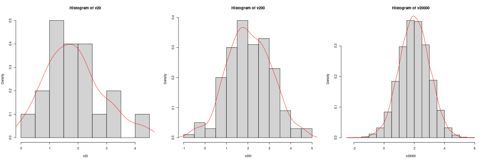
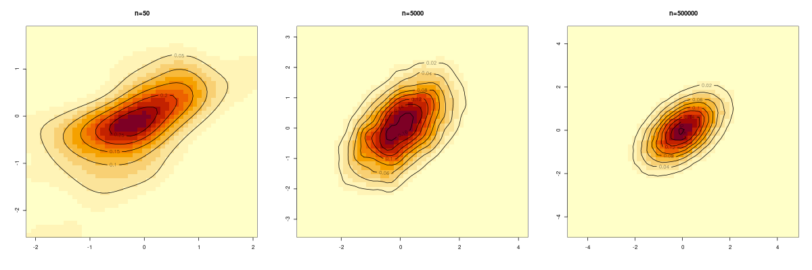

# Week 2 -- R Objects I: Vector, Matrix, and Array

<!--more-->
## Week 2 HW: 
Please play with the syntaxes provided and any other R syntaxes you would like to try out. Getting farmiliar with those syntaxes is important for doing your projects in this course. Use `help()` function or look up the function in CRAN manual, if you are not clear how the function works.

**`For your Week 2 HW grading, please submit some evidence of your syntax practice. You can upload screenshots of your R outputs onto [Canvas](https://canvashelp.ku.edu/).`** If you have any questions, please post your questions on Wk2 discussion board on [Canvas](https://canvashelp.ku.edu/).

## Vectors
In *R*, vectors are the most commonly used objects to store data for statistical modeling and analysis. For example, in a data frame (which we will talk about next week), each column vector usually represents values of a variable cross individual samples, while each row vector represents values for all variables for that sample.

* Entries of a vector can be integers, decimals, characteristics, logical, strings, etc.

```r

A <- 1:20
B <- c(1.46, -0.003, 1.2e-4)
C <- c("Italy", "Egypt", "Mexico")
D <- (A>10)
E <- rep("STAT818", 5)

A
[1]  1  2  3  4  5  6  7  8  9 10 11 12 13 14 15 16 17 18 19 20
B
[1]  1.46000 -0.00300  0.00012
C
[1] "Italy"  "Egypt"  "Mexico"
D
 [1] FALSE FALSE FALSE FALSE FALSE FALSE FALSE FALSE FALSE FALSE  TRUE  TRUE
[13]  TRUE  TRUE  TRUE  TRUE  TRUE  TRUE  TRUE  TRUE
E
[1] "STAT818" "STAT818" "STAT818" "STAT818" "STAT818"

```


* Some basic operation on vectors.


```r

### Name a vector
gdp <- c(2.7, 14.7, 3.8, 5.1, 20.9)
names(gdp) <- c("India", "China",  "Germany", "Japan", "United States")
gdp
        India         China       Germany         Japan United States 
          2.7          14.7           3.8           5.1          20.9 

### Subvector
A1 <- A[A>10]
A1
[1] 11 12 13 14 15 16 17 18 19 20

gdp[which(names(gdp)!="United States")]
  India   China Germany   Japan 
    2.7    14.7     3.8     5.1 
 
### Ranks of a numeric vector
rank(gdp)  
       India         China       Germany         Japan United States 
            1             4             2             3             5 
            
### order of a numeric vector
order(gdp)
[1] 1 3 4 2 5   # Make sure you understand the difference between 'rank' 
		# and 'order' outputs! 

gdp[order(gdp)]
        India       Germany         Japan         China United States 
          2.7           3.8           5.1          14.7          20.9 

gdp[order(gdp, decreasing = TRUE)]
    United States         China         Japan       Germany         India 
             20.9          14.7           5.1           3.8           2.7 

### Combine vectors
c(B, C)
[1] "1.46"    "-0.003"  "0.00012" "Italy"   "Egypt"   "Mexico"  
	#Notice the combined vector becomes a vector of characters.
	
paste(rep("STAT818-Wk", 5), 1:5, sep="")
[1] "STAT818-Wk1" "STAT818-Wk2" "STAT818-Wk3" "STAT818-Wk4" "STAT818-Wk5"

### Set operation on two vectors
S1 <- c("A", "B", "C", "D", "E")
S2 <- c("C", "E", "F","G")

c(S1, S2)
[1] "A" "B" "C" "D" "E" "C" "E" "F" "G"

union(S1, S2)
[1] "A" "B" "C" "D" "E" "F" "G"    # Pay attention to the difference!

intersect(S1, S2)
[1] "C" "E"

setdiff(S1, S2)
[1] "A" "B" "D"

match(S1, S2)
[1] NA NA  1 NA  2

S1[which(!is.na(match(S1, S2)))]
[1] "C" "E"    # Same as intersect(S1, S2), think why is that?

S1[which(is.na(match(S1, S2)))]
[1] "A" "B" "D"    # Same as setdiff(S1, S2).

```

* A vector can contain missing values.

```r

x <- c(4, 7, NA, 9, NA, 32)

### Find out if each entry of x is a missing value or not
 is.na(x)
[1] FALSE FALSE  TRUE FALSE  TRUE FALSE

### Find out which entries contain missing values
which(is.na(x))
[1] 3 5

### Find out which entries are not missing
which(!is.na(x))
[1] 1 2 4 6

### Find out if a vector contains missing value(s)
length(which(is.na(A)))
[1] 0       # A contains zero 'NA', there is no missing value in vector A 

length(which(is.na(x)))
[1] 2       # x contains two missing values.
```

* Now let's try something more challenging: impute the missing values in x with the average of its non-missing values.

```r
x[which(is.na(x))] <- mean(x[which(!is.na(x))])
x
[1]  4  7 13  9 13 32   # Notice 13 is the averge of 4, 7, 9, 32.

```


* Vector arithmetics.

```r

a <- c(1,2,3,4,5)
b <- c(6,7,8,9,10)

mean(a)
[1] 3

sd(a)  # Standard devistion of a
[1] 1.581139

summary(a)
   Min. 1st Qu.  Median    Mean 3rd Qu.    Max. 
      1       2       3       3       4       5 

a+b
[1]  7  9 11 13 15

a*b  # Entry-wise product
[1]  6 14 24 36 50

a%*%b # Dot product of two vectors[*]
     [,1]
[1,]  130

```

[*] [Dot product](https://en.wikipedia.org/wiki/Dot_product) of two K-length vectors is defined to be 

$$ 
a . b =\sum_{k=1}^K {a_k b_k},
$$

where 

$$
a=(a_1, \cdots, a_K)' \mbox{ and }  b=(b_1, \cdots, b_K)'.
$$


* Random vectors

```r

v20 <- rnorm(20, mean=2, sd=1)
mean(v20)
  [1] 1.854119
sd(v20)
  [1] 0.9924311

v200 <- rnorm(200, mean=2, sd=1)
mean(v200)
  [1] 2.061247
sd(v200)
  [1] 1.01953

v20000 <- rnorm(20000, mean=2, sd=1)
mean(v20000)
  [1] 2.001766
sd(v20000)
  [1] 0.9996004
  
```

**Have you been convinced of the [Law of Large Numbers](https://en.wikipedia.org/wiki/Law_of_large_numbers)?**


* Vector of plots. Now let's plot out the histograms of these random vectors in a `vector of plots`! Please remember those vectors are generated from a normal distribution with `mean=2` and `standard deviation=1`. 

```r

par(mfrow = c(1, 3)) # Create a 1 x 3 plotting vector
# The three histograms created will be plotted next to each other

# Histogram 1
hist(v20, prob=TRUE)
lines(density(v20), col = "red")       # Overlay density curve

# Histogram 2
hist(v200, prob=TRUE)
lines(density(v200), col = "red")      

# Histogram 3
hist(v20000, prob=TRUE)
lines(density(v20000), col = "red")   

```
 


**Have you been convinced of the [Central Limit Theorem](https://en.wikipedia.org/wiki/Central_limit_theorem)?**


## Matrices
I guess you are already familiar with the concept of a matirx. However, there are two things I want to point out here:

1. Matrices is a special case of Arrays (which we will talk about next). You can think of a matrix as 2D projection of some 3D array.

2. A matrix is different to a `dataframe` (which we will talk about next week), even though they sometimes look like each other.
	

* Define and assign values to a matrix.

```r

X <- matrix(c(1, 0, 0, 0, 1, 0, 0, 0, 1), nrow = 3)
X
       [,1] [,2] [,3]
  [1,]    1    0    0
  [2,]    0    1    0
  [3,]    0    0    1

X1 <- diag(3)  # X1 same as X
X1
       [,1] [,2] [,3]
  [1,]    1    0    0
  [2,]    0    1    0
  [3,]    0    0    1
  
X <- matrix(c(1:12), nrow=3) 
X
     [,1] [,2] [,3] [,4]
[1,]    1    4    7   10
[2,]    2    5    8   11
[3,]    3    6    9   12
# By default, matrix() stack a vector into a matrix columewise.

X1 <- matrix(c(1:12), nrow=3, byrow=TRUE)
X1
     [,1] [,2] [,3] [,4]
[1,]    1    2    3    4
[2,]    5    6    7    8
[3,]    9   10   11   12

# Option "byrow=TRUE" makes the stacking rowwise.

```

* Naming the rows and columns of matrices.

```r

### We generating a matrix mimicing expression levels for 4 genes and 5 cells 
expMat <- matrix(c(0,1,0,3,0,0,0,0,2,0,1,0,0,0,1,5,0,4,5,0), nrow=5)
expMat 
     [,1] [,2] [,3] [,4]
[1,]    0    0    1    5
[2,]    1    0    0    0
[3,]    0    0    0    4
[4,]    3    2    0    5
[5,]    0    0    1    0

rownames(expMat) <- c("Cencer cell", "T Cell", "B Cell", "stem cell", "muscle cell")
colnames(expMat) <- c("TNF", "EGFR", "IL4", "APOE")
expMat
            TNF EGFR IL4 APOE
Cencer cell   0    0   1    5
T Cell        1    0   0    0
B Cell        0    0   0    4
stem cell     3    2   0    5
muscle cell   0    0   1    0

```

* Submatrix, matrix transpose, determinant of a squared matrix.

```r

X1
     [,1] [,2] [,3] [,4]
[1,]    1    2    3    4
[2,]    5    6    7    8
[3,]    9   10   11   12

X1[2:3, 2:4]
     [,1] [,2] [,3]
[1,]    6    7    8
[2,]   10   11   12


t(X1)
     [,1] [,2] [,3]
[1,]    1    5    9
[2,]    2    6   10
[3,]    3    7   11
[4,]    4    8   12


X <- matrix(rnorm(16), 4, 4)
X
            [,1]       [,2]       [,3]       [,4]
[1,] 0.370402920 -0.1075556 -0.5772708  0.2157153
[2,] 0.996578870 -1.2057802 -0.6337978  1.1679033
[3,] 1.419479131  0.8905424 -0.5620364  0.6918340
[4,] 0.008353184 -0.6162812 -0.1980119 -0.5709147

det(X)
[1] 0.782603

```


* Identify missing values in a matrix.

```r

X <- matrix(c(3.1, NA, 2.5, -1.8, NA, 0.77, -3.0, NA), nrow=4)
X
     [,1]  [,2]
[1,]  3.1    NA
[2,]   NA  0.77
[3,]  2.5 -3.00
[4,] -1.8    NA

which(is.na(X), arr.ind=TRUE) # return positions of three 'NA's
     row col
[1,]   2   1
[2,]   1   2
[3,]   4   2

```

* Calculations on rows or columns of matrices.

```r

X <- matrix(c(1:12), nrow=3)
X 
     [,1] [,2] [,3] [,4]
[1,]    1    4    7   10
[2,]    2    5    8   11
[3,]    3    6    9   12

apply(X, 1, max) # The second argument = 1 lets the apply function act on each row of X matrix 
[1] 10 11 12

apply(X, 2, max) # The second argument = 2 lets the apply function act on each column of X matrix 
[1]  3  6  9 12

```

* Last, let's revisit the multi-dimentional [Central Limit Theorem](https://en.wikipedia.org/wiki/Central_limit_theorem) by generating bivariate normal data matrices and visualising the empirical distribution using heapmaps.

```r

library(MASS) 

mu <- c(0,0)                         # Mean
Sigma <- matrix(c(1, .5, .5, 1), 2)  # Covariance matrix
Sigma
     [,1] [,2]
[1,]  1.0  0.5
[2,]  0.5  1.0

# Generate sample from N(mu, Sigma)
DM50 <-   mvrnorm(50, mu = mu, Sigma = Sigma )
head(DM50)
           [,1]       [,2]
[1,] -1.3746719 -0.6332140
[2,] -0.9617408 -0.1572164
[3,]  0.1257806  0.1259811
[4,]  0.6327408  1.0349557
[5,]  0.9153924  0.3191274
[6,] -0.4941903 -0.2205147

dim(DM50)
[1] 50  2png('Wk2_heatmap.png', height=400, width=1200)
par(mfrow = c(1, 3)) # Create a 1 x 3 plotting vector
# The three heatmaps created will be plotted next to each other

# Calculate kernel density estimate
DM50.kde <- kde2d(DM50[,1], DM50[,2], n = 50)   # from MASS package
image(DM50.kde)       # from base graphics package
contour(DM50.kde, add = TRUE)     # from base graphics package

DM5000.kde <- kde2d(DM5000[,1], DM5000[,2], n = 50)   
image(DM5000.kde)      
contour(DM5000.kde, add = TRUE)     

DM500000.kde <- kde2d(DM500000[,1], DM500000[,2], n = 50)   
image(DM500000.kde)      
contour(DM500000.kde, add = TRUE)     
dev.off()


DM5000 <-   mvrnorm(5000, mu = mu, Sigma = Sigma )
dim(DM5000)
[1] 5000    2


DM500000 <-   mvrnorm(500000, mu = mu, Sigma = Sigma )
dim(DM500000)
[1] 500000      2


# Contour plot overlayed on heatmaps for visulizing their distribution
par(mfrow = c(1, 3)) # Create a 1 x 3 plotting vector
# The three heatmaps created will be plotted next to each other

# Calculate kernel density estimate
DM50.kde <- kde2d(DM50[,1], DM50[,2], n = 50)   # from MASS package
image(DM50.kde)       # from base graphics package
contour(DM50.kde, add = TRUE)     # from base graphics package
title(main = "n=50", font.main = 4)             # add title

DM5000.kde <- kde2d(DM5000[,1], DM5000[,2], n = 50)   
image(DM5000.kde)      
contour(DM5000.kde, add = TRUE)    
title(main = "n=5000", font.main = 4) 

DM500000.kde <- kde2d(DM500000[,1], DM500000[,2], n = 50)   
image(DM500000.kde)      
contour(DM500000.kde, add = TRUE)   
title(main = "n=500000", font.main = 4)  

``` 



**Further convinced about the [Central Limit Theorem](https://en.wikipedia.org/wiki/Central_limit_theorem)?**


## Arrays

An array is a multi-dimensional object where all the entries have the same class (e.g. they are all numeric). 


```r

Arr <- array(c(1:24), dim=c(4,3,2))
Arr
, , 1

     [,1] [,2] [,3]
[1,]    1    5    9
[2,]    2    6   10
[3,]    3    7   11
[4,]    4    8   12

, , 2

     [,1] [,2] [,3]
[1,]   13   17   21
[2,]   14   18   22
[3,]   15   19   23
[4,]   16   20   24

```

Each entry of an 3D array is a matrix.


* 2D projection matrix of a 3D array.

```r

Arr[,,1]
     [,1] [,2] [,3]
[1,]    1    5    9
[2,]    2    6   10
[3,]    3    7   11
[4,]    4    8   12

Arr[,2,]
     [,1] [,2]
[1,]    5   17
[2,]    6   18
[3,]    7   19
[4,]    8   20

Arr[3,,]
     [,1] [,2]
[1,]    3   15
[2,]    7   19
[3,]   11   23

```

* Apply function to a 3D array.

```r

apply(Arr, 1, max)
[1] 21 22 23 24

apply(Arr, 2, max)
[1] 16 20 24

apply(Arr, 3, max)
[1] 12 24

```

Might need some thinking to clear this out...

